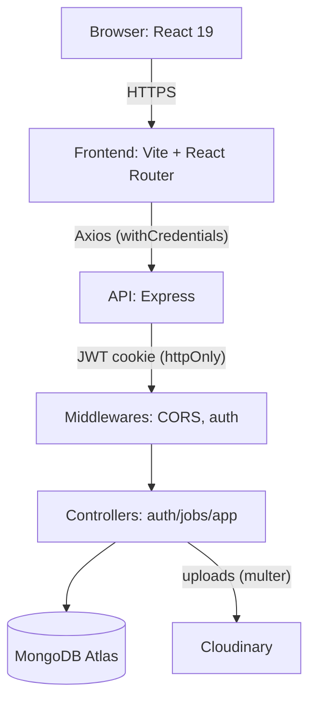

# JobBridge Africa

[](https://opensource.org/licenses/MIT)


**🌐 Live Application:** [https://www.jobbridgeafrica.org](https://www.jobbridgeafrica.org)

JobBridge Africa is a MERN-stack platform connecting African job seekers with employers, aligned with SDG 8 (Decent Work and Economic Growth). It includes candidate profiles with completion tracking, job search and application workflows, employer job posting, and AI-powered job matching.

This README documents the current system, setup, tooling, conventions, and a roadmap (monetization, in-app chat for job seekers to connect, and more).

---

## Contents

- Overview
- Repository
- SDG 8: Decent Work and Economic Growth
- SDG 8 Targets Mapping
- Features (Current)
- Roadmap (Planned)
- Architecture
- Architecture Diagram
- Project Structure
- Tech Stack & Tools
- Local Development (Windows)
- Environment Variables
- Running the App
- API Endpoints (Summary)
- Frontend Routes (Summary)
- Data Models
- Profile Completion Logic
- Code Quality, Linting
- Deployment Notes
- Contributing
- Author
- License

---

## Overview

- Two apps in one repo:
  - `backend/` — Node/Express API with MongoDB (Mongoose), JWT auth via httpOnly cookies, Cloudinary file storage
  - `frontend/` — React 19 + Vite + Tailwind 4, React Router 7
- Authentication: JWT in httpOnly cookies (CORS-enabled)
- Storage: MongoDB Atlas (recommended) and Cloudinary (profile photos, resumes)
- Profile completion: 7-part scoring system used to gate job application readiness

---

## Repository

SSH (recommended if you’ve set up SSH keys):

```bash
git clone git@github.com:Nattydread777/jobbridge-africa.git
```

You can then open the folder in your editor:

```bash
cd jobbridge-africa
```

HTTPS (alternative):

```bash
git clone https://github.com/Nattydread777/jobbridge-africa.git
```

---

## SDG 8: Decent Work and Economic Growth

United Nations SDG 8 promotes sustained, inclusive and sustainable economic growth, full and productive employment, and decent work for all.

Key challenges in many African contexts

- High youth unemployment and underemployment; large NEET population
- Informal labor markets with limited protections and low wages
- Skills mismatch between education outputs and employer needs
- Geographic constraints and limited access to quality opportunities
- Low hiring transparency and weak employer–talent signaling

How JobBridge Africa helps

- Access: Centralized job discovery across countries and cities with filters and AI recommendations
- Employability: Profile completion guidance (photo, resume, education, experience, skills) to help candidates present job-ready profiles
- Matching: AI-assisted matching routes job seekers to relevant roles, reducing search friction and employer screening costs
- Inclusion: Remote and flexible roles surfaced to reduce geographic and mobility barriers
- Employer enablement: Simple tools for posting and managing jobs, improving transparency and response
- Data foundation: Structured profiles and application data to inform future analytics on skills gaps and training needs

Planned impact extensions

- Learning and upskilling pathways linked to skills gaps and local market needs
- Youth engagement campaigns and referral programs
- Monetization that sustains the platform while preserving open access for job seekers

## SDG 8 Targets Mapping

| SDG Target                                                                                                | Challenge Addressed                                    | How JobBridge Africa Contributes                                                                     |
| --------------------------------------------------------------------------------------------------------- | ------------------------------------------------------ | ---------------------------------------------------------------------------------------------------- |
| 8.2: Achieve higher levels of economic productivity through diversification, tech upgrade, and innovation | Low productivity, skills not aligned with market needs | AI job matching, structured profiles, and future analytics help align talent with productive sectors |
| 8.5: Full and productive employment and decent work for all, equal pay for work of equal value            | Underemployment, barriers for women and youth          | Inclusive access to roles (incl. remote), transparent listings, and better employer–talent signaling |
| 8.6: Substantially reduce youth not in employment, education, or training (NEET)                          | High youth unemployment/NEET rates                     | Profile completion guidance, resume support, and planned learning pathways to improve employability  |

This mapping will evolve as we implement learning integrations, mentorship, and community features.

## Features (Current)

Job seeker

- Register/Login
- Edit profile: basic info, education, experience, skills
- Profile photo upload (Cloudinary)
- Resume upload (stored in Cloudinary via application submission flow)
- Completion status across Dashboard/Profile pages
- Browse jobs, view details, apply with resume; view "My Applications"
- AI Matching page (API stub ready; returns recommended jobs via `/api/ai/match`)

Employer

- Post jobs, update, delete (auth + role-based)
- View incoming applications per job and update status

Platform

- Error-handling middleware and structured controllers
- CORS configured for local Vite dev servers

---

## Roadmap (Planned)

- Monetization
  - Employer subscriptions and credits for posting jobs and viewing applicants
  - Featured job listings and sponsored placements
  - Payment integrations (e.g., Paystack/Flutterwave)
- Real-time Chat System
  - Job seekers can connect with each other (communities, mentorship)
  - Employer-applicant chat on job postings
  - WebSocket/Socket.IO or managed real-time service
- AI Enhancements
  - Resume parsing pipeline (OCR/NLP), semantic matching with embeddings
  - Smart skill extraction and gap analysis
- Internationalization (i18n) and accessibility improvements
- Notifications (email + in-app)
- Admin panel for moderation and metrics

---

### Roadmap (Phased)

| Phase   | Focus              | Key Items                                                                       |
| ------- | ------------------ | ------------------------------------------------------------------------------- |
| Phase 1 | Core hiring loop   | Profiles with completion, job CRUD, applications, Cloudinary uploads            |
| Phase 2 | Matching & quality | AI matching improvements, resume parsing pipeline, skills gap hints             |
| Phase 3 | Monetization       | Employer subscriptions, credits, featured jobs, payments (Paystack/Flutterwave) |
| Phase 4 | Community & chat   | Job seeker networking, employer–applicant chat (Socket.IO), moderation tools    |
| Phase 5 | Analytics & i18n   | Insights dashboards, i18n, accessibility, notifications                         |

## Architecture

- API server (`backend/server.js`) exposes REST endpoints under `/api/*`
- Frontend (`frontend/`) consumes API via Axios (`src/services/api.js`)
- Auth via JWT cookie, validated by `protect` middleware
- Role-based access: `employer` middleware restricts job management
- File uploads
  - Profile images: memory upload → Cloudinary (face-centered 400×400 crop)
  - Resumes: uploaded on application submit → Cloudinary (converted to PDF when possible)
- Data persistence: MongoDB with Mongoose models (User, Job, Application)

---

## Architecture Diagram

```text
┌─────────────┐         HTTPS            ┌───────────────┐
│   Browser   │ ───────────────────────▶ │   Frontend    │
│ (React 19)  │                          │ (Vite + RRD)  │
└─────────────┘                          └──────┬────────┘
                 │ Axios (withCredentials)
                 ▼
               ┌──────┴────────┐
               │    API        │
               │ (Express)     │
               └──────┬────────┘
          JWT cookie (httpOnly) │  Middlewares (CORS, auth)
                 ▼
             ┌────────┴─────────┐
             │  Controllers     │
             │  (auth/jobs/app) │
             └────────┬─────────┘
                 │ Mongoose
                 ▼
            ┌─────────┴──────────┐
            │     MongoDB        │
            │   (Atlas/local)    │
            └────────────────────┘
                 │ uploads (multer)
                 ▼
               ┌──────┴────────┐
               │   Cloudinary  │
               │ (images/CVs)  │
               └───────────────┘
```

---

<details>
<summary>Mermaid (GitHub-rendered) diagram</summary>



</details>

---

## Project Structure

High-level folder and file layout:

```text
JOBBRIDGE-AFRICA/
├─ README.md
├─ backend/
│  ├─ package.json
│  ├─ server.js
│  ├─ config/
│  │  ├─ cloudinary.js
│  │  └─ db.js
│  ├─ controllers/
│  │  ├─ aiController.js
│  │  ├─ applicationController.js
│  │  ├─ authController.js
│  │  └─ jobController.js
│  ├─ middleware/
│  │  ├─ authMiddleware.js
│  │  └─ errorMiddleware.js
│  ├─ models/
│  │  ├─ Application.js
│  │  ├─ Job.js
│  │  └─ userModel.js
│  ├─ routes/
│  │  ├─ aiRoutes.js
│  │  ├─ applicationRoutes.js
│  │  ├─ authRoutes.js
│  │  └─ jobRoutes.js
│  └─ utils/
│     └─ generateToken.js
│
├─ frontend/
│  ├─ package.json
│  ├─ vite.config.js
│  ├─ tailwind.config.js
│  ├─ postcss.config.js
│  ├─ eslint.config.js
│  ├─ public/
│  │  └─ index.html
│  └─ src/
│     ├─ main.jsx
│     ├─ App.jsx
│     ├─ App.css
│     ├─ index.css
│     ├─ services/
│     │  └─ api.js
│     ├─ context/
│     │  └─ AuthContext.jsx
│     ├─ routes/
│     │  └─ AppRoutes.jsx
│     ├─ components/
│     │  ├─ AuthForm.jsx
│     │  ├─ Employers.jsx
│     │  ├─ Footer.jsx
│     │  ├─ Header.jsx
│     │  ├─ JobCard.jsx
│     │  └─ Loader.jsx
│     ├─ data/
│     │  └─ africaLocations.js
│     └─ pages/
│        ├─ Dashboard.jsx
│        ├─ Profile.jsx
│        ├─ ProfileView.jsx
│        ├─ Jobs.jsx
│        ├─ JobDetails.jsx
│        ├─ MyJobs.jsx
│        ├─ PostJob.jsx
│        ├─ EmployerDashboard.jsx
│        ├─ AIMatching.jsx
│        ├─ Login.jsx
│        ├─ Register.jsx
│        ├─ Home.jsx
│        ├─ About.jsx
│        ├─ Contact.jsx
│        ├─ SDGImpact.jsx
│        ├─ PanAfricanNetwork.jsx
│        └─ Employers.jsx
```

---

## Tech Stack & Tools

Backend

- Node.js, Express, Mongoose
- JWT (`jsonwebtoken`), `cookie-parser`, `cors`, `dotenv`
- `multer` for uploads, `cloudinary` SDK
- Dev: `nodemon`

Frontend

- React 19, React Router 7
- Vite (rolldown-vite), Tailwind CSS v4
- Axios, ESLint 9

Infrastructure

- MongoDB Atlas (recommended)
- Cloudinary: media storage for images/resumes

---

## Local Development (Windows)

Prereqs

- Node.js 18+
- MongoDB Atlas connection string (or local MongoDB)
- Cloudinary account (cloud name, API key, API secret)

Clone and install

```powershell
# From the folder where you want the project
cd $HOME\Desktop
# If already cloned, skip the next line
# SSH:
# git clone git@github.com:Nattydread777/jobbridge-africa.git JOBBRIDGE-AFRICA
cd JOBBRIDGE-AFRICA

# Install backend deps
cd backend; npm install; cd ..

# Install frontend deps
cd frontend; npm install; cd ..
```

---

## Environment Variables

Create `backend/.env` with at least:

```
NODE_ENV=development
PORT=4000
MONGO_URI=<your mongodb uri>

# JWT and cookie
JWT_SECRET=<random-long-secret>
JWT_EXPIRE=7d
COOKIE_EXPIRE=7

# Cloudinary
CLOUDINARY_CLIENT_NAME=<cloud_name>
CLOUDINARY_CLIENT_API=<api_key>
CLOUDINARY_CLIENT_SECRET=<api_secret>
```

Notes

- For production, update CORS origin in `backend/server.js` to your frontend domain.
- Frontend currently points to `http://localhost:4000/api` in `frontend/src/services/api.js`.

Optional frontend `.env` (future enhancement)

- You can refactor `api.js` to use `import.meta.env.VITE_API_BASE`.

### Email Configuration (Zoho + SendGrid Fallback)

Add these to `backend/.env` for production email delivery:

```
# Primary SMTP (Zoho)
EMAIL_HOST=smtp.zoho.com
EMAIL_PORT=587            # use 465 for SSL if 587 blocked
EMAIL_SECURE=false        # set true if using 465
EMAIL_USER=info@jobbridgeafrica.org
EMAIL_PASS=<zoho_app_password>

# Optional SendGrid fallback (used automatically if SMTP fails)
SENDGRID_API_KEY=<your_sendgrid_api_key>

# CORS origins (comma-separated)
ALLOWED_ORIGINS=https://www.jobbridgeafrica.org,https://jobbridge-africa.vercel.app
```

How it works:

- App first tries SMTP on the configured port (defaults to 587 STARTTLS).
- Falls back to 465/SSL if verification fails.
- If both fail and `SENDGRID_API_KEY` is present, switches to SendGrid.
- Contact form responses include a `transport` field and diagnostics when failures occur.

Health check endpoint (SMTP connectivity only): `GET /api/contact/health`

Troubleshooting:

- Timeouts: Often host egress restrictions; try switching ports or confirm outbound rules.
- Zoho + 2FA: Use an App Password (Zoho Mail Settings → Security → App Passwords).
- SendGrid: Verify domain & sender identity to avoid silent drops.
- Improve deliverability: Add SPF + DKIM records for `jobbridgeafrica.org` (recommended future step).

---

## Running the App

Run backend API

```powershell
cd backend
npm run dev  # uses nodemon
```

API server will start on http://localhost:4000

Run frontend (in a second terminal)

```powershell
cd frontend
npm run dev
```

Vite dev server starts (usually on http://localhost:5173)

If `npm run dev` fails in the frontend, ensure Node 18+ is installed and dependencies are correctly installed. Try `npm install` again.

---

## API Endpoints (Summary)

Auth (`/api/auth`)

- POST `/register` — Register
- POST `/login` — Login (sets httpOnly JWT cookie)
- POST `/logout` — Logout (clears cookie)
- GET `/me` — Current user profile (protected)
- PUT `/profile` — Update profile fields (protected)
- POST `/upload-profile-image` — Upload avatar (multer memoryStorage → Cloudinary) (protected)

Jobs (`/api/jobs`)

- GET `/` — Public list (filter by `search`, `country`, `city`, `jobType`)
- GET `/:id` — Job detail
- POST `/` — Create job (employer only)
- PUT `/:id` — Update job (employer only)
- DELETE `/:id` — Delete job (employer only)

Applications (`/api/applications`)

- POST `/` — Submit application (resume upload via Cloudinary) (protected)
- GET `/my-applications` — Applicant’s applications (protected)
- GET `/job/:jobId` — Employer view applications (protected)
- PUT `/:id/status` — Employer updates app status (protected)
- DELETE `/:id` — Applicant delete their application (protected)

AI (`/api/ai`)

- GET `/match` — Get recommended jobs for current user (protected)

---

## Frontend Routes (Summary)

- `/` — Home
- `/about`, `/contact`, `/sdg-impact`, `/pan-african-network`
- Auth: `/login`, `/register`
- Dashboard: `/dashboard` (job seeker), `/employer-dashboard` (employer)
- Profile: `/profile` (editor), `/profile-view` (viewer)
- Jobs: `/jobs`, `/jobs/:id`, `/post-job`, `/my-jobs`
- AI Matching: `/ai-matching`

---

## Data Models

User

- role: `job_seeker | employer | admin`
- Profile fields: `country`, `bio` (<= 300 chars), `education[]`, `experience[]`, `skills[]`
- Media: `profileImageUrl/profileImagePublicId`, `resumeUrl`
- Employer: `companyName`

Job

- Fields: `title, companyName, company (User ref), location, jobType, salaryRange, description, requirements, responsibilities, benefits, expiryDate, applicationEmail, postedBy`

Application

- Fields: `job (ref), applicant (ref), coverLetter, resumeUrl, resumePublicId, status`
- Status lifecycle: `pending → reviewed → shortlisted → rejected/accepted`

---

## Profile Completion Logic

For job seekers, completion is computed out of 7 checks:

1. Profile photo (`profileImageUrl`)
2. Resume (`resumeUrl`)
3. Country
4. Bio
5. Education array has entries
6. Experience array has entries
7. Skills array has entries

Application gating

- Applying to jobs checks for required profile elements. Completion UI is shown on Dashboard, Profile, and Profile View pages.

---

## Code Quality & Linting

Frontend

- ESLint 9 + React hooks & refresh plugins
- Tailwind CSS v4 (PostCSS plugin via Vite)

Run lint

```powershell
cd frontend
npm run lint
```

---

## Deployment Notes

- Backend
  - Set `NODE_ENV=production`
  - Update CORS allowed origin in `backend/server.js`
  - Provide all env vars in production environment
- Frontend
  - Build with `npm run build` and serve via static host or CDN
  - Point API base to your backend domain (update `src/services/api.js` or use env)
- Cloudinary
  - Ensure the configured Cloudinary account and folder conventions exist

---

## Contributing

- Fork and create a feature branch
- Follow existing code style and file structure
- Add tests where feasible (controllers/routes)
- For UI, keep Tailwind utility-first approach consistent
- Open a PR describing the change and screenshots where relevant

---

## Author

**Usikpedo Nathaniel (Nigeria)** — Founder, Project Manager & Software Developer

- Email: [info@jobbridgeafrica.org](mailto:info@jobbridgeafrica.org)
- Website: [https://www.jobbridgeafrica.org](https://www.jobbridgeafrica.org)
- LinkedIn: Add your profile URL here

Nathaniel is a certified MERN Full‑Stack Developer and SDG 8 advocate. He leads the strategic and technical direction of JobBridge Africa, focusing on AI‑powered matching, inclusive access to decent work, and Pan‑African collaboration.

---

## License

MIT © 2025 jobbridge-africa
